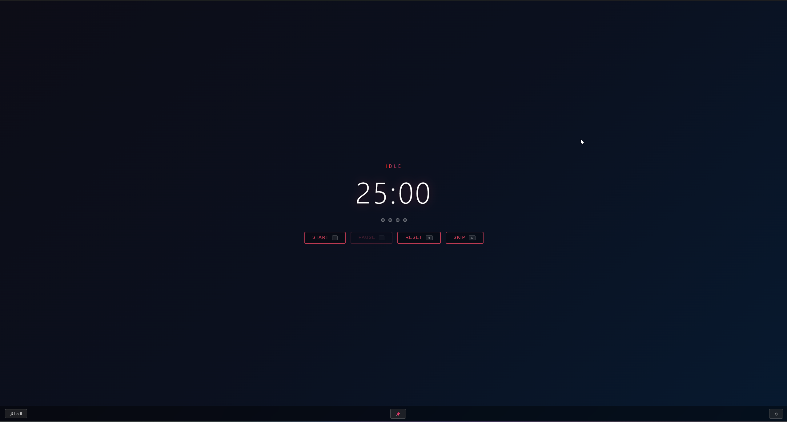
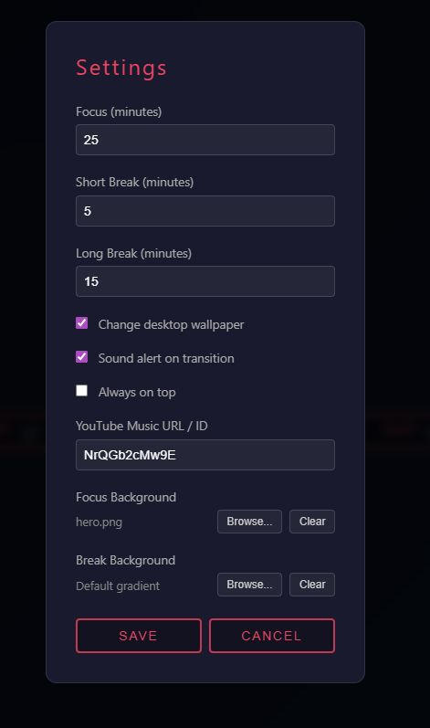

# PulsoDoro

A distraction-free Pomodoro timer built with Tauri v2 by [DHJVC Labs](https://dhjvc.com).


## Features

- **Pomodoro Timer** - Classic 25/5/15 cycle with 4-session rounds
- **Custom Backgrounds** - Set different background images for focus and break sessions
- **Desktop Wallpaper Switching** - Automatically changes your desktop wallpaper based on timer state
- **Guided Break Activities** - Random suggestions during breaks (stretch, hydrate, breathe, walk)
- **Lo-fi Music** - Built-in YouTube lo-fi streams toggle for ambient focus music
- **System Tray** - Start, pause, reset from the tray without opening the window
- **Configurable Durations** - Adjust focus, short break, and long break lengths
- **Settings Persistence** - All preferences saved locally as JSON

## Download

**Windows installers** available on the [Releases page](https://github.com/jcharvet/pulsodoro/releases/latest).

## Screenshots

| Timer | Settings |
|-------|----------|
|  |  |

## Tech Stack

- **Frontend:** Vanilla HTML, CSS, JavaScript
- **Backend:** Rust (Tauri v2)
- **Desktop Integration:** Wallpaper switching via `wallpaper` crate
- **Build Tool:** Vite

## Getting Started

### Prerequisites (all platforms)

- [Node.js](https://nodejs.org/) (v18+)
- [Rust](https://www.rust-lang.org/tools/install) (stable)

### Windows

No additional dependencies needed. Just install Node.js and Rust.

### Linux (Debian/Ubuntu)

Install the required system libraries:

```bash
sudo apt install libwebkit2gtk-4.1-dev build-essential libssl-dev libgtk-3-dev libayatana-appindicator3-dev librsvg2-dev
```

### Linux (Fedora)

```bash
sudo dnf install webkit2gtk4.1-devel openssl-devel gtk3-devel libappindicator-gtk3-devel librsvg2-devel
```

### Linux (Arch)

```bash
sudo pacman -S webkit2gtk-4.1 base-devel openssl gtk3 libappindicator-gtk3 librsvg
```

### Installation

```bash
git clone https://github.com/jcharvet/pulsodoro.git
cd pulsodoro
npm install
```

### Development

```bash
npm run tauri dev
```

### Build

```bash
npm run tauri build
```

Installers will be generated in `src-tauri/target/release/bundle/`:
- **Windows:** `.exe` (NSIS) and `.msi`
- **Linux:** `.deb` and `.AppImage`

## Usage

1. Click **Start** to begin a 25-minute focus session
2. When the timer ends, a break starts automatically with a suggested activity
3. After 4 focus sessions, you get a long break
4. Open **Settings** (gear icon) to customize durations and backgrounds
5. Click the **Lo-fi** button to toggle ambient music
6. The app lives in your system tray for quick access

## Project Structure

```
pulsodoro/
├── index.html              # Main app layout
├── src/
│   ├── main.js             # Frontend logic (timer UI, settings, music)
│   └── styles.css          # Dark theme with state-based accent colors
├── src-tauri/
│   ├── src/
│   │   ├── main.rs          # Entry point
│   │   ├── lib.rs           # Tauri setup, commands, tray, timer loop
│   │   ├── timer.rs         # Pomodoro state machine
│   │   ├── settings.rs      # Settings persistence (JSON)
│   │   └── wallpaper_manager.rs  # Desktop wallpaper switching
│   ├── capabilities/        # Tauri v2 permissions
│   ├── resources/wallpapers/ # Bundled wallpaper images
│   └── tauri.conf.json      # Tauri configuration
└── package.json
```

## License

MIT
