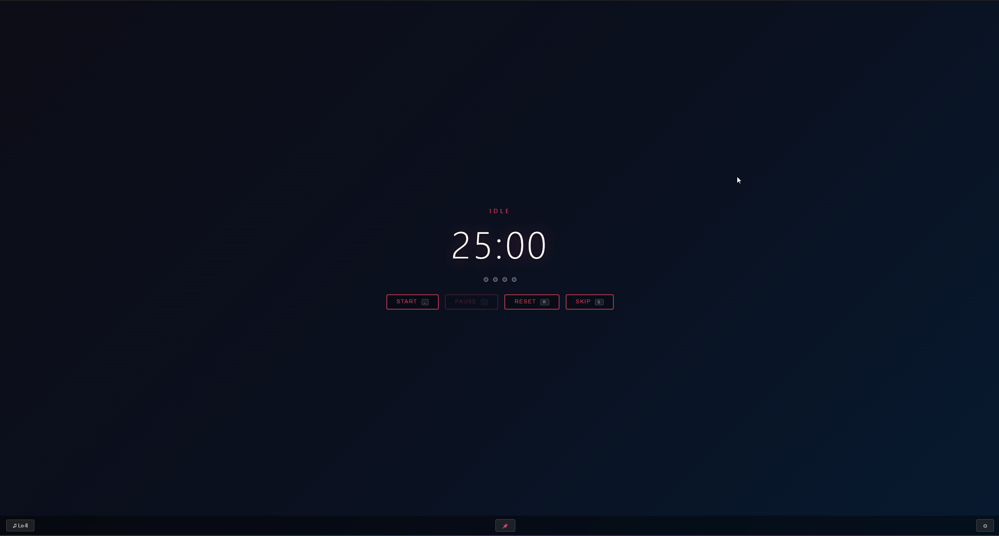
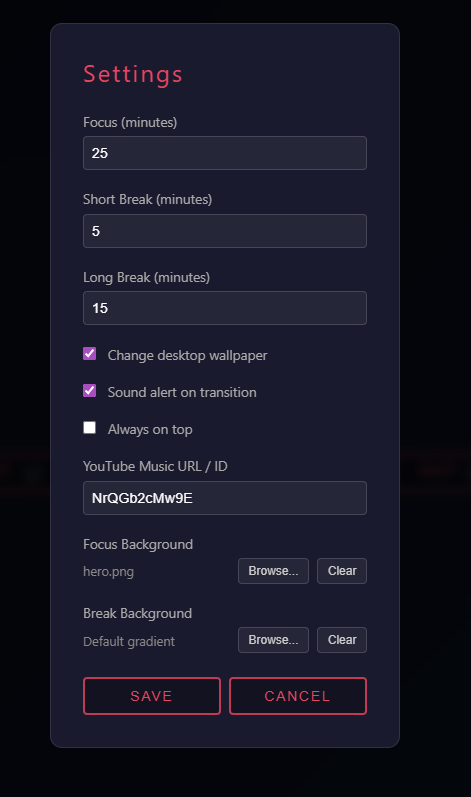

# PulsoDoro

A distraction-free Pomodoro timer built with Tauri v2 by [DHJVC Labs](https://dhjvc.com).


## Features

- **Pomodoro Timer** — Classic 25/5/15 cycle with 4-session rounds
- **Tidal Music** — Browse and play Tidal in a built-in browser window (login once, session remembered)
- **YouTube Lo-fi** — Built-in YouTube lo-fi streams toggle for ambient focus music
- **Progress Ring** — Chronograph-style ring with tick marks, glow, and endpoint pulse
- **Session Stats** — Track completed focus sessions (today / this week) in the bottom bar
- **Custom Backgrounds** — Set different background images for focus and break sessions
- **Desktop Wallpaper Switching** — Automatically changes your desktop wallpaper based on timer state
- **Guided Break Activities** — Random suggestions during breaks (stretch, hydrate, breathe, walk)
- **Always on Top** — Pin the window above other apps while you work
- **Keyboard Shortcuts** — Space (start/pause), R (reset), S (skip), F11 (fullscreen)
- **System Tray** — Start, pause, reset from the tray without opening the window
- **Tabbed Settings** — Timer, Music, and Appearance settings organized in tabs
- **Settings Persistence** — All preferences saved locally as JSON

## Download

**Windows installers** available on the [Releases page](https://github.com/jcharvet/pulsodoro/releases/latest).

## Screenshots

| Timer | Settings |
|-------|----------|
|  |  |

## Tech Stack

- **Frontend:** Vanilla HTML, CSS, JavaScript
- **Backend:** Rust (Tauri v2)
- **Desktop Integration:** Wallpaper switching via `wallpaper` crate
- **Build Tool:** Vite

## Getting Started

### Prerequisites (all platforms)

- [Node.js](https://nodejs.org/) (v18+)
- [Rust](https://www.rust-lang.org/tools/install) (stable)

### Windows

No additional dependencies needed. Just install Node.js and Rust.

### Linux (Debian/Ubuntu)

Install the required system libraries:

```bash
sudo apt install libwebkit2gtk-4.1-dev build-essential libssl-dev libgtk-3-dev libayatana-appindicator3-dev librsvg2-dev
```

### Linux (Fedora)

```bash
sudo dnf install webkit2gtk4.1-devel openssl-devel gtk3-devel libappindicator-gtk3-devel librsvg2-devel
```

### Linux (Arch)

```bash
sudo pacman -S webkit2gtk-4.1 base-devel openssl gtk3 libappindicator-gtk3 librsvg
```

### Installation

```bash
git clone https://github.com/jcharvet/pulsodoro.git
cd pulsodoro
npm install
```

### Development

```bash
npm run tauri dev
```

### Build

```bash
npm run tauri build
```

Installers will be generated in `src-tauri/target/release/bundle/`:
- **Windows:** `.exe` (NSIS) and `.msi`
- **Linux:** `.deb` and `.AppImage`

## Usage

1. Click **Start** to begin a 25-minute focus session
2. When the timer ends, a break starts automatically with a suggested activity
3. After 4 focus sessions, you get a long break
4. Open **Settings** (gear icon) to customize durations, music, and appearance
5. Click **Music** to toggle YouTube lo-fi or open your Tidal library
6. The app lives in your system tray for quick access

### Tidal Music

1. Go to **Settings > Music** and select **Tidal** as your source
2. Click the **Music** button — a Tidal window opens
3. Log in with your Tidal account (only needed once — session is remembered)
4. Pick your music and hit play
5. Click **Music** again to hide the window — audio keeps playing
6. Click **Music** to bring it back anytime

## Project Structure

```
pulsodoro/
├── index.html              # Main app layout
├── src/
│   ├── main.js             # Frontend logic (timer UI, settings, music)
│   └── styles.css          # Dark theme with state-based accent colors
├── src-tauri/
│   ├── src/
│   │   ├── main.rs          # Entry point
│   │   ├── lib.rs           # Tauri setup, commands, tray, timer loop, Tidal window
│   │   ├── timer.rs         # Pomodoro state machine
│   │   ├── settings.rs      # Settings persistence (JSON)
│   │   ├── stats.rs         # Session stats tracking (today/week)
│   │   └── wallpaper_manager.rs  # Desktop wallpaper switching
│   ├── capabilities/        # Tauri v2 permissions
│   ├── resources/wallpapers/ # Bundled wallpaper images
│   └── tauri.conf.json      # Tauri configuration
└── package.json
```

## License

MIT
